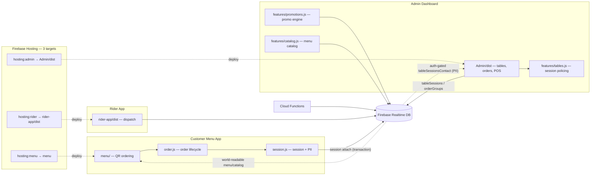

# Prasant Pizza ERP — Architecture

## Key flows
- Order: created as `Pending` → promoted to `Placed` only after session attach succeeds.
- PII (phone) lives in `tableSessionsContact` (auth-gated); `tableSessions` is world-readable without it.
- Totals everywhere use `_effectiveTotal(sess)` — table card, drawer, CSV, KPI.
- Billing excludes cancelled orders; `_policeExpiredSessions` cancels orders and clears arrays on expiry.

## Deployment
`npm run build` then `firebase deploy --only hosting:admin` (per target), or all: `firebase deploy --only database,hosting`.
